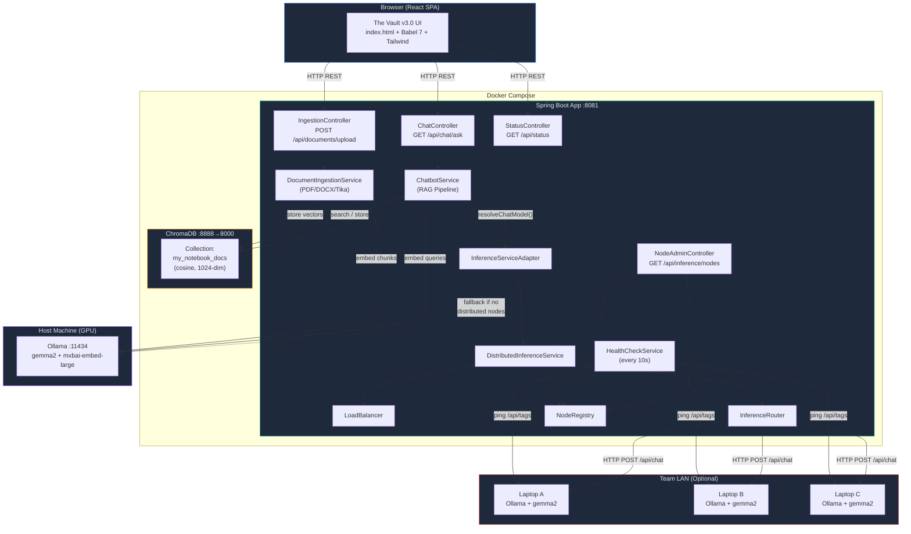
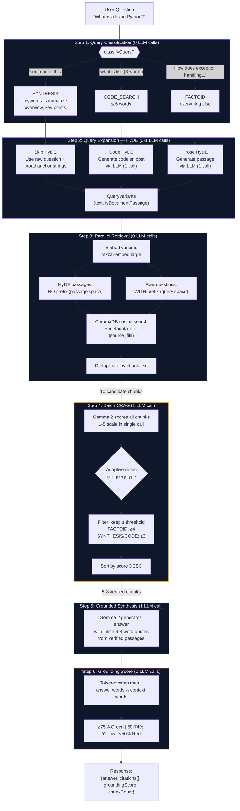
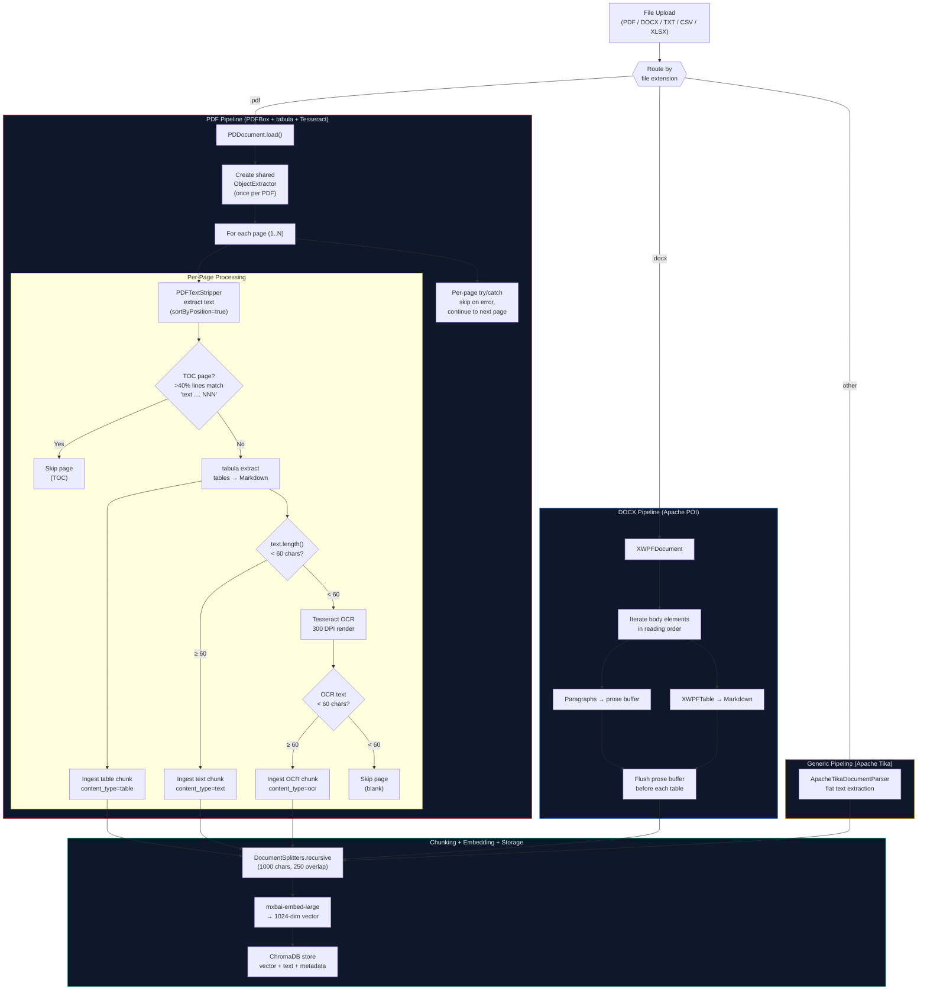
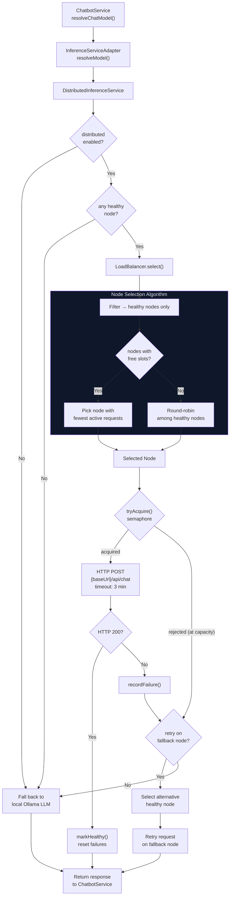
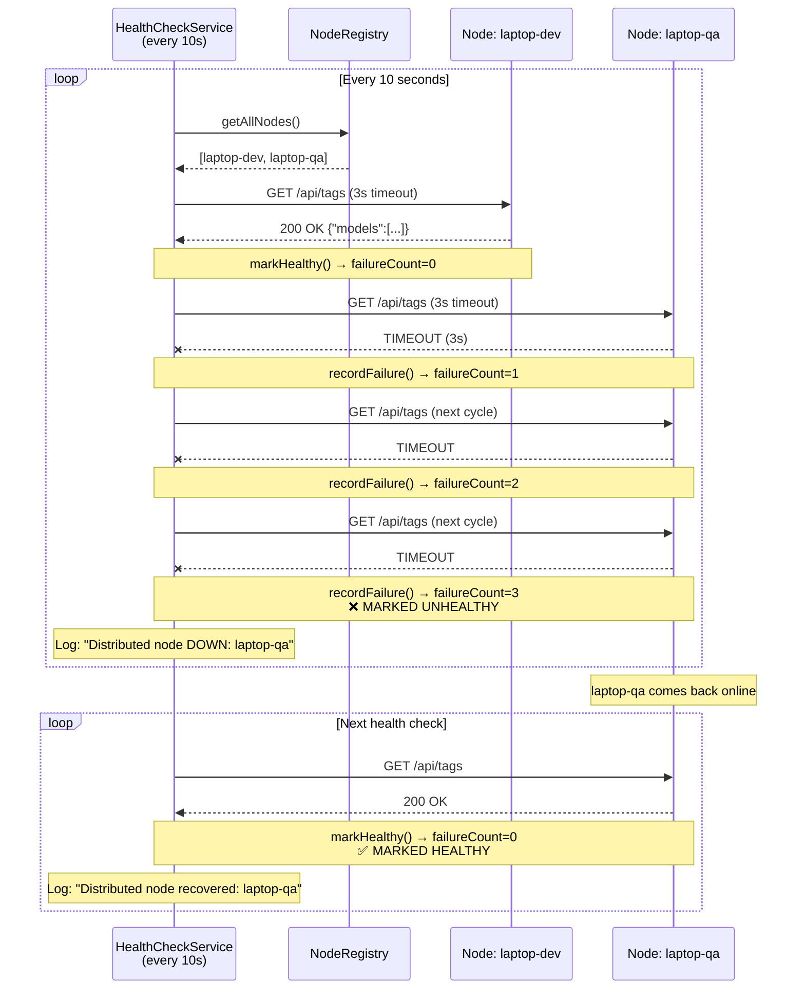
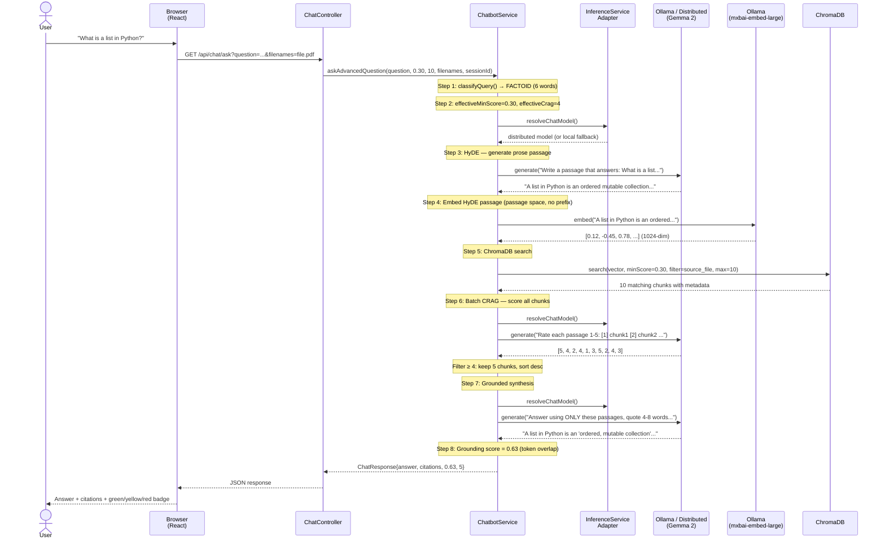
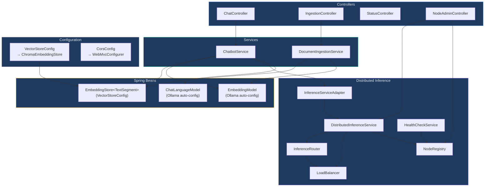
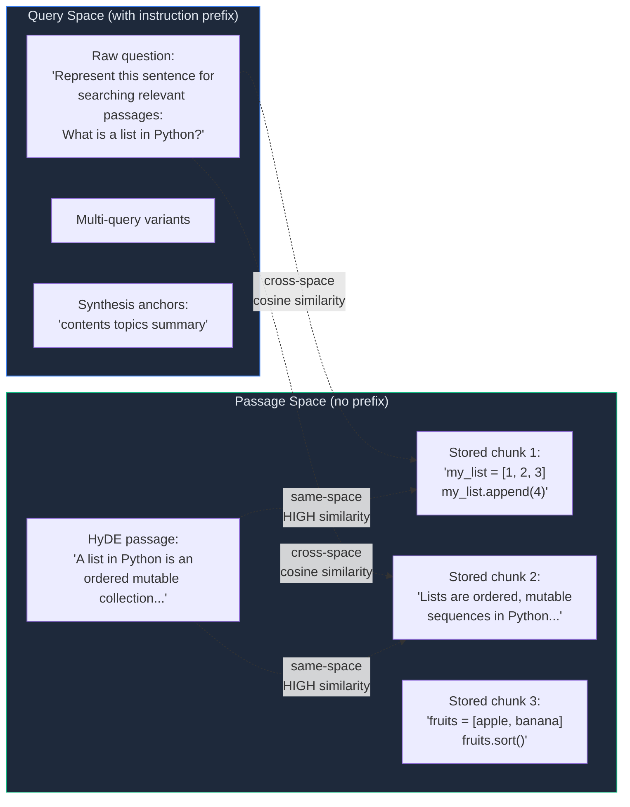

# The Vault v3 — Architecture Diagrams (Mermaid)

> Paste any diagram into [mermaid.live](https://mermaid.live) or any Mermaid-compatible renderer (GitHub, Notion, Obsidian, VS Code preview).

---

## 1. System Overview — All Services and Connections

---

## 2. RAG Query Pipeline — Full 6-Step Flow

---

## 3. Document Ingestion Pipeline

---

## 4. Distributed Inference — Load Balancing and Failover

---

## 5. Health Check Lifecycle

---

## 6. Full Request Lifecycle — Sequence Diagram

---

## 7. Spring Bean Dependency Graph

---

## 8. Embedding Space — Query vs Passage

> **Key insight:** HyDE passages are embedded in **passage space** (same as stored documents) so they have high similarity to real chunks. Raw questions are embedded in **query space** with the instruction prefix — the model bridges the two spaces at search time.

---

## How to Render These Diagrams

**Option 1 — GitHub:** Push this file to GitHub. GitHub renders Mermaid natively in markdown.

**Option 2 — VS Code:** Install the "Markdown Preview Mermaid Support" extension.

**Option 3 — Online:** Copy any code block to [mermaid.live](https://mermaid.live) for instant rendering + PNG/SVG export.

**Option 4 — Notion/Obsidian:** Both support Mermaid in code blocks natively.
