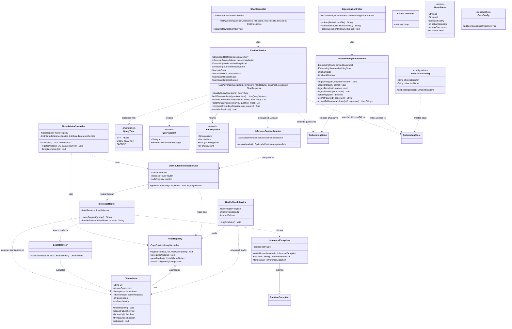
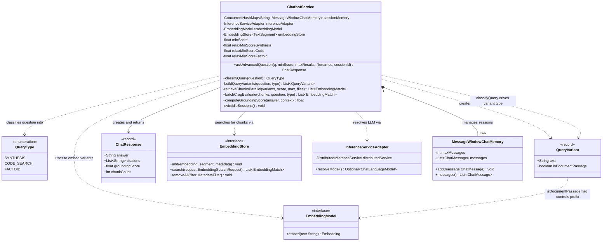

# OOD Class Diagram & Divide and Conquer
## The Vault — Local CRAG Chatbot | Domain Design

> **Project:** The Vault v3.3 — Privacy-first, fully local AI document Q&A system  
> **Submission covers:** Task 1 (OOD Class Diagram) and Task 2 (Divide and Conquer)

---

## Table of Contents

1. [Task 1 — OOD Class Diagram (Full System)](#task-1--ood-class-diagram-full-system)
   - [1.1 What OOD Means for This Project](#11-what-ood-means-for-this-project)
   - [1.2 All Classes — Attributes and Methods](#12-all-classes--attributes-and-methods)
   - [1.3 Full Mermaid Class Diagram](#13-full-mermaid-class-diagram)
   - [1.4 OOP Principles Applied](#14-oop-principles-applied)
2. [Task 2 — Divide and Conquer](#task-2--divide-and-conquer)
   - [2.1 How the Domain Was Divided](#21-how-the-domain-was-divided)
   - [2.2 The Four Subsystems](#22-the-four-subsystems)
   - [2.3 Chosen Subsystem — SS2: RAG Pipeline](#23-chosen-subsystem--ss2-rag-pipeline)
   - [2.4 SS2 Detailed Class Diagram](#24-ss2-detailed-class-diagram)
   - [2.5 Internal Class Relationships Explained](#25-internal-class-relationships-explained)

---

## Task 1 — OOD Class Diagram (Full System)

### 1.1 What OOD Means for This Project

Object-Oriented Design (OOD) is the process of modelling a system as a set of **objects** that each encapsulate data (attributes) and behaviour (methods), and that communicate through well-defined interfaces. In The Vault, every major responsibility is represented by a class. The OOD class diagram shows:

- Every class, its attributes (fields), and its methods
- The **relationships** between classes: which class depends on which, which creates which, which contains which
- The **visibility** of each member: `+` public, `-` private, `#` protected

The system follows a layered architecture. Data always flows in ONE direction:

```
Frontend (index.html)
      ↓ HTTP
Controllers (Layer 1)   ← parse HTTP, call service, return JSON
      ↓ calls
Services (Layer 2)      ← all business logic lives here
      ↓ uses
Infrastructure (Layer 3) ← ChromaDB, Ollama, config beans
```

This layering is an OOD pattern called **Separation of Concerns** — each layer has exactly one job and has no knowledge of the layers above it.

---

### 1.2 All Classes — Attributes and Methods

#### Layer 1 — HTTP Controllers (Entry Points)

---

**`ChatController`**
> Responsibility: Parse the `/api/chat/ask` HTTP request and forward it to `ChatbotService`. Returns `ChatResponse` as JSON.

| Visibility | Member | Type | Description |
|---|---|---|---|
| `-` | `chatbotService` | `ChatbotService` | Injected by Spring |
| `+` | `askQuestion(question, filenames, minScore, maxResults, sessionId)` | `ChatResponse` | Main chat endpoint |
| `+` | `clearHistory(sessionId)` | `void` | Wipes the session's 20-message memory |

OOD note: `ChatController` has **no business logic**. It only converts HTTP parameters into Java objects and delegates. This is the **Single Responsibility Principle** — the controller's only reason to change is if the HTTP API contract changes.

---

**`IngestionController`**
> Responsibility: Accept file uploads, save to a temp file, and trigger the ingestion pipeline.

| Visibility | Member | Type | Description |
|---|---|---|---|
| `-` | `documentIngestionService` | `DocumentIngestionService` | Injected by Spring |
| `+` | `upload(file: MultipartFile)` | `String` | Single-file upload |
| `+` | `uploadBatch(files: MultipartFile[])` | `String` | Multi-file upload |
| `+` | `deleteDocument(filename: String)` | `void` | Remove all vectors for a file |

---

**`StatusController`**
> Responsibility: Return system health information.

| Visibility | Member | Type | Description |
|---|---|---|---|
| `+` | `status()` | `Map<String, String>` | Returns model names, version, status |

---

**`NodeAdminController`**
> Responsibility: Manage distributed inference nodes at runtime without restarting the app.

| Visibility | Member | Type | Description |
|---|---|---|---|
| `-` | `nodeRegistry` | `NodeRegistry` | Injected by Spring |
| `-` | `distributedInferenceService` | `DistributedInferenceService` | Injected by Spring |
| `+` | `listNodes()` | `List<NodeStatus>` | Returns status of all registered nodes |
| `+` | `registerNode(id, url, maxConcurrent)` | `void` | Add a team laptop dynamically |
| `+` | `deregisterNode(id)` | `void` | Remove a node |

---

#### Layer 2 — Core Services (All Business Logic)

---

**`ChatbotService`** ← THE most important class in the system
> Responsibility: Execute the complete 6-step RAG pipeline for every user question.

| Visibility | Member | Type | Description |
|---|---|---|---|
| `-` | `sessionMemory` | `ConcurrentHashMap<String, MessageWindowChatMemory>` | Per-tab isolated 20-message windows |
| `-` | `inferenceAdapter` | `InferenceServiceAdapter` | Resolves local vs remote LLM |
| `-` | `embeddingModel` | `EmbeddingModel` | mxbai-embed-large via Ollama |
| `-` | `embeddingStore` | `EmbeddingStore<TextSegment>` | ChromaDB connection |
| `-` | `minScore` | `float` | Default similarity threshold (0.30) |
| `-` | `relaxMinScoreSynthesis` | `float` | Floor override for summary queries (0.20) |
| `-` | `relaxMinScoreCode` | `float` | Floor override for code queries (0.20) |
| `-` | `relaxMinScoreFactoid` | `float` | Floor override for factoid queries (0.20) |
| `+` | `askAdvancedQuestion(q, minScore, maxResults, filenames, sessionId)` | `ChatResponse` | Full 6-step pipeline |
| `+` | `classifyQuery(question)` | `QueryType` | Zero LLM calls — pure regex classification |
| `-` | `buildQueryVariants(question, type)` | `List<QueryVariant>` | HyDE or broad anchors |
| `-` | `retrieveChunksParallel(variants, score, max, files)` | `List<EmbeddingMatch>` | Parallel ChromaDB search |
| `+` | `batchCragEvaluate(chunks, question, type)` | `List<EmbeddingMatch>` | 1-call batch scoring 1–5 |
| `+` | `computeGroundingScore(answer, context)` | `float` | Token overlap metric |
| `-` | `evictIdleSessions()` | `void` | Scheduled: remove sessions idle >30 min |

The pipeline steps inside `askAdvancedQuestion`:
1. `classifyQuery()` → SYNTHESIS / CODE_SEARCH / FACTOID
2. Compute `effectiveMinScore = Math.min(userMinScore, relaxMinScore)`
3. `buildQueryVariants()` → HyDE via Gemma 2 (1 LLM call) or anchor strings
4. `retrieveChunksParallel()` → embed variants, search ChromaDB in parallel
5. `batchCragEvaluate()` → Gemma 2 scores all chunks 1–5 (1 LLM call)
6. Grounded synthesis → Gemma 2 writes answer with inline quotes (1 LLM call)
7. `computeGroundingScore()` → token overlap → returns `ChatResponse`

---

**`DocumentIngestionService`**
> Responsibility: Convert uploaded files into 1024-dimensional vectors and store them in ChromaDB.

| Visibility | Member | Type | Description |
|---|---|---|---|
| `-` | `embeddingModel` | `EmbeddingModel` | mxbai-embed-large |
| `-` | `embeddingStore` | `EmbeddingStore<TextSegment>` | ChromaDB |
| `-` | `chunkSize` | `int` | 1000 characters |
| `-` | `chunkOverlap` | `int` | 250 characters |
| `+` | `ingestFile(path, originalFilename)` | `void` | Routes to correct parser by extension |
| `-` | `ingestPdf(path, name)` | `void` | PDFBox + tabula + Tesseract per page |
| `-` | `ingestDocx(path, name)` | `void` | Apache POI table-aware |
| `-` | `ingestGeneric(path, name)` | `void` | Apache Tika fallback |
| `-` | `isTocPage(text)` | `boolean` | >40% lines match "text .... NNN" → skip |
| `-` | `ocrPdfPage(pdf, pageNum)` | `String` | Tesseract at 300 DPI |
| `-` | `extractTablesAsMarkdown(pdf, pageNum)` | `List<String>` | tabula-java table extraction |

---

#### Layer 3 — Value Objects and Enums

---

**`QueryType`** ← `«enumeration»`
> Represents the result of classifying a user question. Controls CRAG thresholds and HyDE strategy.

| Constant | Trigger Condition | CRAG Threshold | HyDE Strategy |
|---|---|---|---|
| `SYNTHESIS` | Contains: summarize, overview, key points | ≥ 3 | Skip HyDE — use broad anchor strings |
| `CODE_SEARCH` | Question is ≤ 5 words | ≥ 3 | Generate code snippet via LLM |
| `FACTOID` | Everything else | ≥ 3 | Generate prose passage via LLM |

---

**`QueryVariant`** ← `«record»` (immutable value object)
> Holds one variant of the user's question, and a flag controlling which embedding space to use.

| Field | Type | Description |
|---|---|---|
| `text` | `String` | The query text (either raw question or HyDE passage) |
| `isDocumentPassage` | `boolean` | `true` → embed without instruction prefix (passage space) |

Why this matters: `mxbai-embed-large` is asymmetric. Documents land in passage space. HyDE passages must also land in passage space to find matches. Setting `isDocumentPassage=true` skips the instruction prefix `"Represent this sentence for searching..."`.

---

**`ChatResponse`** ← `«record»` (immutable value object)
> The JSON response sent back to the browser.

| Field | Type | Description |
|---|---|---|
| `answer` | `String` | The generated answer with inline quotes |
| `citations` | `List<String>` | The exact text passages that passed CRAG |
| `groundingScore` | `float` | 0.0–1.0. ≥0.75=High, 0.50–0.74=Medium, <0.50=Low |
| `chunkCount` | `int` | How many chunks were verified and used |

---

**`NodeStatus`** ← `«record»` (immutable value object)
> JSON response body for the `/api/inference/nodes` endpoint.

| Field | Type | Description |
|---|---|---|
| `id` | `String` | Node identifier (e.g., "myself", "laptop-b") |
| `url` | `String` | Full Ollama URL |
| `healthy` | `boolean` | Current health state |
| `activeRequests` | `int` | Live request count |
| `maxConcurrent` | `int` | Semaphore capacity |
| `failureCount` | `int` | Consecutive ping failures |

---

#### Layer 4 — Distributed Inference

---

**`InferenceServiceAdapter`**
> Responsibility: Thin bridge between `ChatbotService` and the distributed inference system. Decouples RAG logic from infrastructure.

| Visibility | Member | Type | Description |
|---|---|---|---|
| `-` | `distributedService` | `DistributedInferenceService` | Injected by Spring |
| `+` | `resolveModel()` | `Optional<ChatLanguageModel>` | Returns remote model or empty (→ use local) |

OOD principle: **Dependency Inversion**. `ChatbotService` depends on `InferenceServiceAdapter` (abstraction), not directly on `DistributedInferenceService` (concrete). Swapping the distributed system doesn't touch RAG code.

---

**`DistributedInferenceService`**
> Responsibility: High-level facade. Checks if distributed mode is enabled and healthy nodes exist.

| Visibility | Member | Type | Description |
|---|---|---|---|
| `-` | `enabled` | `boolean` | From `inference.distributed.enabled` |
| `-` | `router` | `InferenceRouter` | Injected |
| `-` | `registry` | `NodeRegistry` | Injected |
| `+` | `getRemoteModel()` | `Optional<ChatLanguageModel>` | Delegates to router if enabled |

---

**`InferenceRouter`**
> Responsibility: Execute one LLM call against a selected node. Handles semaphore acquisition, HTTP dispatch, and failover.

| Visibility | Member | Type | Description |
|---|---|---|---|
| `-` | `loadBalancer` | `LoadBalancer` | Injected |
| `+` | `routeRequest(prompt)` | `String` | Full route → acquire → send → release lifecycle |
| `-` | `handleFailover(failedNode, prompt)` | `String` | Retry on next healthy node |

---

**`LoadBalancer`**
> Responsibility: Select the best `OllamaNode` for the next request using the fewest-active-requests strategy.

| Visibility | Member | Type | Description |
|---|---|---|---|
| `+` | `selectNode(nodes: List<OllamaNode>)` | `OllamaNode` | Filter healthy → prefer free slots → fewest active → fallback round-robin |

---

**`OllamaNode`**
> Responsibility: Represents one Ollama instance. Manages concurrency and health state.

| Visibility | Member | Type | Description |
|---|---|---|---|
| `-` | `url` | `String` | e.g., `http://192.168.1.5:11434` |
| `-` | `maxConcurrent` | `int` | From config or runtime registration |
| `-` | `semaphore` | `Semaphore` | Enforces `maxConcurrent` at JVM level |
| `-` | `activeRequests` | `AtomicInteger` | Real-time counter, thread-safe |
| `-` | `failureCount` | `int` | Incremented on ping failure, reset on success |
| `-` | `healthy` | `boolean` | False after `maxFailures` consecutive failures |
| `+` | `markHealthy()` | `void` | Reset failureCount to 0, set healthy=true |
| `+` | `recordFailure()` | `void` | Increment failureCount, mark unhealthy if ≥ maxFailures |
| `+` | `isHealthy()` | `boolean` | Return current health state |
| `+` | `tryAcquire()` | `boolean` | Non-blocking semaphore acquire |
| `+` | `release()` | `void` | Release semaphore permit |

---

**`NodeRegistry`**
> Responsibility: Authoritative list of all registered nodes. Thread-safe for concurrent access by health checks and request threads.

| Visibility | Member | Type | Description |
|---|---|---|---|
| `-` | `nodes` | `CopyOnWriteArrayList<OllamaNode>` | Thread-safe list |
| `+` | `registerNode(id, url, maxConcurrent)` | `void` | Add a node (runtime) |
| `+` | `deregisterNode(id)` | `void` | Remove a node |
| `+` | `getAllNodes()` | `List<OllamaNode>` | Returns all nodes for iteration |
| `-` | `parseConfig(configString)` | `void` | Parse `id\|url\|max` from `application.properties` at startup |

---

**`HealthCheckService`**
> Responsibility: Periodically ping every registered node and update their health state.

| Visibility | Member | Type | Description |
|---|---|---|---|
| `-` | `registry` | `NodeRegistry` | Injected |
| `-` | `intervalSeconds` | `int` | From config (default: 10) |
| `-` | `maxFailures` | `int` | From config (default: 3) |
| `-` | `scheduler` | `ScheduledExecutorService` | Runs ping loop |
| `+` | `pingAllNodes()` | `void` | Scheduled method — pings `GET /api/tags` on each node with 3s timeout |

---

**`InferenceException`** ← extends `RuntimeException`
> Responsibility: Typed exception for distributed inference failures with metadata about retryability.

| Visibility | Member | Type | Description |
|---|---|---|---|
| `-` | `retryable` | `boolean` | `true` for network errors, `false` for auth errors |
| `+` | `nodeUnreachable(url)` | `InferenceException` | Factory — retryable=true |
| `+` | `allNodesDown()` | `InferenceException` | Factory — retryable=false |
| `+` | `timeout(url)` | `InferenceException` | Factory — retryable=true |

---

#### Layer 5 — Configuration and Infrastructure

---

**`VectorStoreConfig`** ← `@Configuration`
> Responsibility: Create the `EmbeddingStore<TextSegment>` Spring bean that connects to ChromaDB.

| Visibility | Member | Type | Description |
|---|---|---|---|
| `-` | `chromaBaseUrl` | `String` | From `chroma.base-url` in properties |
| `-` | `collectionName` | `String` | `"my_notebook_docs"` |
| `+` | `embeddingStore()` | `EmbeddingStore<TextSegment>` | `@Bean` — ChromaDB connection |

Both `ChatbotService` and `DocumentIngestionService` inject this SAME bean. Ingestion writes, querying reads — they share the collection.

---

**`CorsConfig`** ← `@Configuration`
> Responsibility: Allow the browser to call `/api/**` endpoints from a different port or ngrok domain.

| Visibility | Member | Type | Description |
|---|---|---|---|
| `+` | `addCorsMappings(registry)` | `void` | Sets `Access-Control-Allow-Origin: *` on all `/api/**` paths |

---

### 1.3 Full  Class Diagram




---

### 1.4 OOP Principles Applied

| Principle | Where Applied | How |
|---|---|---|
| **Single Responsibility** | Every class | `ChatController` only parses HTTP. `ChatbotService` only runs RAG. `HealthCheckService` only pings nodes. |
| **Open/Closed** | `DocumentIngestionService` | New file formats (e.g., PPTX) added by adding `ingestPptx()` — existing methods never modified. |
| **Liskov Substitution** | `EmbeddingModel`, `EmbeddingStore` | Any LangChain4j-compliant embedding model or vector store substitutes without breaking callers. |
| **Interface Segregation** | `EmbeddingModel`, `EmbeddingStore` | `ChatbotService` only uses `search()` on the store; `DocumentIngestionService` only uses `add()`. Narrow interfaces. |
| **Dependency Inversion** | `ChatbotService` → `InferenceServiceAdapter` | The RAG brain depends on an adapter abstraction, not directly on distributed infrastructure. |
| **Encapsulation** | `OllamaNode` | `semaphore`, `activeRequests`, `failureCount` are private. State changes only through `markHealthy()`, `recordFailure()`. |
| **Composition over Inheritance** | `DistributedInferenceService` | Composed of `InferenceRouter` + `NodeRegistry` rather than extending either. |
| **Immutability** | `ChatResponse`, `QueryVariant`, `NodeStatus` | Declared as Java `record` — all fields final, no setters, thread-safe by definition. |

---

## Task 2 — Divide and Conquer

### 2.1 How the Domain Was Divided

The **Divide and Conquer** principle in software design means splitting a complex domain into smaller, independently understandable and maintainable subsystems, where each subsystem:
- Has a **single clear responsibility**
- Communicates with other subsystems only through **defined interfaces**
- Can be **developed, tested, and scaled independently**

The Vault domain was analysed by asking: "What are the distinct jobs this system performs?" Four jobs emerged with no overlap:

| Job | Who does it | Subsystem |
|---|---|---|
| Accept HTTP and return HTTP | Controllers | SS1: API Gateway |
| Reason, retrieve, and synthesise answers | ChatbotService + value objects | SS2: RAG Pipeline |
| Parse files and create vectors | DocumentIngestionService + parsers | SS3: Document Ingestion |
| Route LLM requests to the right GPU | Inference classes | SS4: Distributed Inference |

---

### 2.2 The Four Subsystems

#### SS1 — API Gateway Subsystem

**Responsibility:** HTTP entry/exit points only. Parse requests, call the right service, return responses. Zero business logic.

**Classes:**
- `ChatController` — GET /api/chat/ask, POST /api/chat/clear
- `IngestionController` — POST /api/documents/upload, DELETE /api/documents/delete
- `StatusController` — GET /api/status
- `NodeAdminController` — GET/POST /api/inference/nodes/*

**Why it's its own subsystem:** The HTTP framework (Spring MVC) can be swapped for gRPC or GraphQL without touching any RAG, ingestion, or inference code.

**Interfaces it exposes to the outside world:**
- HTTP REST API consumed by the React frontend

**Interfaces it consumes:**
- `ChatbotService.askAdvancedQuestion(...)` — from SS2
- `DocumentIngestionService.ingestFile(...)` — from SS3
- `NodeRegistry` — from SS4

---

#### SS2 — RAG Pipeline Subsystem

**Responsibility:** All reasoning about documents. Classify the question → expand into hypothetical passages → search ChromaDB → verify quality → synthesise a grounded answer.

**Classes:**
- `ChatbotService` — orchestrates all 6 pipeline steps
- `QueryType` — enumeration of question categories
- `QueryVariant` — value object holding a query text + embedding-space flag
- `ChatResponse` — immutable value object returned to caller

**Why it's its own subsystem:** The entire retrieval strategy (HyDE, CRAG scoring, grounding) can be redesigned without touching file parsing or HTTP routing.

**Interfaces it exposes:**
- `askAdvancedQuestion(question, minScore, maxResults, filenames, sessionId): ChatResponse`

**Interfaces it consumes:**
- `EmbeddingModel.embed(text)` — LangChain4j abstraction
- `EmbeddingStore.search(request)` — LangChain4j abstraction
- `InferenceServiceAdapter.resolveModel()` — from SS4

---

#### SS3 — Document Ingestion Subsystem

**Responsibility:** All file parsing. Accept any supported format → extract structured text → chunk at safe sizes → embed → write to ChromaDB.

**Classes:**
- `DocumentIngestionService` — format router and pipeline orchestrator
- Internal: PDF parser (PDFBox + tabula-java + Tesseract), DOCX parser (Apache POI), Generic parser (Apache Tika)

**Why it's its own subsystem:** Adding support for a new file format (e.g., PPTX, HTML) requires changes only inside this subsystem. No RAG logic or HTTP routing is affected.

**Interfaces it exposes:**
- `ingestFile(filePath, originalFilename): void`

**Interfaces it consumes:**
- `EmbeddingModel.embed(text)` — LangChain4j abstraction
- `EmbeddingStore.add(vector, segment, metadata)` — LangChain4j abstraction

---

#### SS4 — Distributed Inference Subsystem

**Responsibility:** All LLM request routing. Maintain a registry of Ollama nodes → load-balance requests across them → health-check continuously → fail over when a node dies.

**Classes:**
- `InferenceServiceAdapter` — thin bridge to the rest of the system
- `DistributedInferenceService` — enabled/disabled facade
- `InferenceRouter` — HTTP dispatch + failover
- `LoadBalancer` — node selection algorithm
- `OllamaNode` — single node state (semaphore, health, active count)
- `NodeRegistry` — thread-safe list of all nodes
- `HealthCheckService` — scheduled pinger
- `InferenceException` — typed failure with retryable flag
- `NodeStatus` — immutable view of node state for API responses

**Why it's its own subsystem:** The load balancing strategy can be upgraded (e.g., to weighted round-robin), or the entire distributed system can be disabled (`inference.distributed.enabled=false`), without touching RAG or ingestion code.

**Interfaces it exposes:**
- `InferenceServiceAdapter.resolveModel(): Optional<ChatLanguageModel>` — returns a remote LLM or empty

**Interfaces it consumes:**
- HTTP GET `{nodeUrl}/api/tags` — Ollama health endpoint
- HTTP POST `{nodeUrl}/api/chat` — Ollama chat endpoint

---

### 2.3 Chosen Subsystem — SS2: RAG Pipeline

**Why this subsystem was chosen for deep analysis:**

The RAG Pipeline is the intellectual core of The Vault. It contains the most complex class (`ChatbotService`), the most non-obvious design decisions (HyDE, asymmetric embedding spaces, batch CRAG), and the most interesting class relationships. Understanding how `ChatbotService`, `QueryType`, `QueryVariant`, and `ChatResponse` relate to each other is the key to understanding what makes this system different from a basic vector search.

---

### 2.4 SS2 Detailed Class Diagram



---

### 2.5 Internal Class Relationships Explained

#### Relationship 1: `ChatbotService` → `QueryType` (Dependency / Uses)

`ChatbotService.classifyQuery(question)` uses pure regex to return a `QueryType` value. No LLM call is made. This `QueryType` then drives:
- Which `effectiveMinScore` floor to apply (`Math.min(userScore, relaxFloor)`)
- Whether to skip HyDE (SYNTHESIS) or generate code/prose (CODE_SEARCH/FACTOID)
- Which CRAG scoring rubric to inject into the batch prompt

**Why a separate enum instead of a string or boolean?**
An enum makes the classification exhaustive and type-safe at compile time. Adding a fourth query type requires adding a constant and handling it in every switch statement — the compiler ensures nothing is missed.

---

#### Relationship 2: `ChatbotService` creates `QueryVariant` instances (Instantiation)

`buildQueryVariants()` creates a `List<QueryVariant>`. Each variant has:
- `text` — the actual text to embed
- `isDocumentPassage` — controls which embedding space the text lands in

This flag exists because `mxbai-embed-large` is **asymmetric**:
- `isDocumentPassage=false` → embed with instruction prefix → query space
- `isDocumentPassage=true` → embed WITHOUT prefix → passage space (same as stored documents)

HyDE passages generated by the LLM have `isDocumentPassage=true`. They land in passage space and achieve much higher cosine similarity with stored document chunks.

---

#### Relationship 3: `ChatbotService` → `EmbeddingModel` and `EmbeddingStore` (Dependency / Uses)

`ChatbotService` never instantiates these directly. Spring injects them as beans. This is the **Dependency Inversion Principle** — the RAG service depends on interfaces (`EmbeddingModel`, `EmbeddingStore`), not concrete implementations (`OllamaEmbeddingModel`, `ChromaEmbeddingStore`). The entire vector database or embedding model can be swapped by changing `application.properties`, not Java code.

---

#### Relationship 4: `ChatbotService` **composes** `MessageWindowChatMemory` (Composition)

`ChatbotService` maintains a `ConcurrentHashMap<String, MessageWindowChatMemory>`. The key is the UUID session ID generated by each browser tab. The value is a 20-message sliding window.

This is **composition** — `ChatbotService` owns and manages the memory objects. When a session is evicted (30-minute idle), `ChatbotService` removes the entry and the `MessageWindowChatMemory` is garbage-collected.

**Why 20 messages?** Gemma 2 9B has an 8,192-token context window. 20 messages × ~220 tokens = 4,400 tokens, leaving ~3,700 tokens for document context chunks.

---

#### Relationship 5: `ChatbotService` → `InferenceServiceAdapter` (Dependency with Decoupling)

`ChatbotService` calls `inferenceAdapter.resolveModel()` to get the LLM to use. The adapter returns `Optional<ChatLanguageModel>`:
- `Optional.empty()` → use the local Ollama model (always available as fallback)
- `Optional.of(remoteModel)` → use a distributed node from the team LAN

This design means the entire distributed inference system (SS4) is optional and transparent to SS2. Disabling `inference.distributed.enabled=false` in config makes the adapter always return empty — SS2 code is unchanged.

---

#### Relationship 6: `ChatbotService` returns `ChatResponse` (Instantiation / Creates)

`ChatResponse` is a Java `record` — immutable, no setters, auto-generated `equals()`, `hashCode()`, and `toString()`. It is created once at the end of the pipeline and passed back through the controller to the browser as JSON.

**Why immutable?** The response object crosses thread boundaries (from the async retrieval pool back to the main thread) and is serialised by Jackson. Immutability guarantees no partial state is ever observed.

---

## Summary

### Task 1 Summary

The full system contains **19 classes** across 5 layers:
- 4 Controllers (HTTP entry points)
- 2 Core Services (all business logic)
- 4 Value objects and enums (QueryType, QueryVariant, ChatResponse, NodeStatus)
- 9 Distributed Inference classes (adapter, service, router, balancer, node, registry, health check, exception, status)
- 2 Config classes (VectorStoreConfig, CorsConfig)

Key OOP patterns used: Single Responsibility, Dependency Inversion, Composition over Inheritance, Immutable Value Objects, Interface Segregation.

### Task 2 Summary

The domain divides naturally into **4 subsystems** with minimal coupling:

| Subsystem | Core Class | Input | Output |
|---|---|---|---|
| SS1: API Gateway | Controllers | HTTP request | HTTP response (JSON) |
| SS2: RAG Pipeline | ChatbotService | User question | ChatResponse with citations |
| SS3: Document Ingestion | DocumentIngestionService | File bytes | Vectors in ChromaDB |
| SS4: Distributed Inference | InferenceRouter + LoadBalancer | LLM prompt | Generated text string |

The **RAG Pipeline (SS2)** was analysed in depth because it contains the most design decisions: query classification drives CRAG thresholds, `QueryVariant.isDocumentPassage` controls embedding space, batch CRAG reduces 31 LLM calls to 1, and the grounding score gives transparent quality feedback.

---
